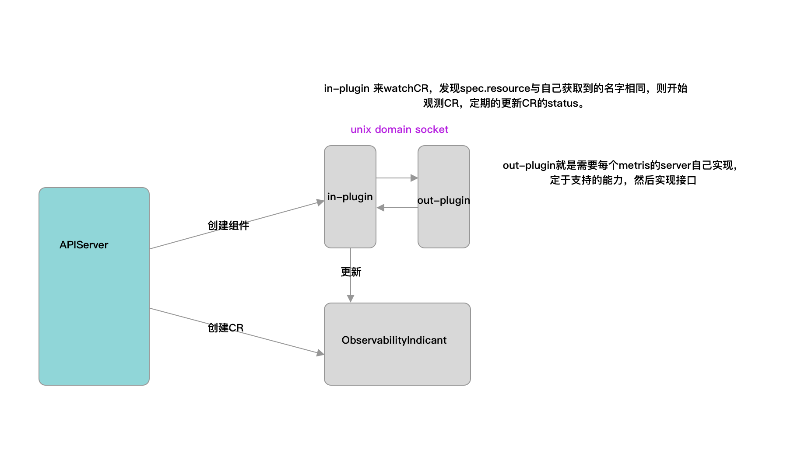

`arbiter-observer` is mainly used to collect metrics-server, prometheus and other related data to provide unified resource access for the scheduler.
Provides a data source for the scheduler. And follow-up as a unified monitoring data panel to provide data visualization support capabilities.

## Design

`arbiter-observer` is mainly implemented in the form of `operator`. Periodically obtain monitoring data and fill in the status field.
The data acquisition form supports metric-server and prometheus in the first version.
Data sources such as metric-server and prometheus are deployed with arbiter-server through sidecar. The two communicate via `rpc` and `socket`.

`arbiter-observer` selects target resources by resource name, or labels. At present, `ObservabilityIndicant` does not process a group of data, so you need to combine the index when using the labels. For the data obtained through the labels, sort the data by name, and select index. If the subscript exceeds the length of the resource list, no data acquisition coroutine will be started.


Currently you can set template query statements in spec, such as PromQL `sum(node_memory_MemTotal_bytes{instance="{{.metadata.name}}"} - node_memory_MemAvailable_bytes{instance="{{.metadata.name}}"})`. When executed, the information of the actual resource will be filled into the query statement.


**Architecture diagram**



**Timing diagram**


## GRPC Data Format Definition
```grpc
service Server {
    rpc GetPluginName (GetPluginNameRequest)
        returns (GetPluginNameResponse) {}
    
    rpc PluginCapabilities (PluginCapabilitiesRequest)
        returns (PluginCapabilitiesResponse) {}

    rpc GetMetrics (GetMetricsRequest)
        returns (GetMetricsResponse) {}
}
```

There are three interfaces are defined, `GetPluginName` gets the name of the data source, `arbiter-observer` judges by combining this name with `spec.source` of `ObservabilityIndicant`,

Whether the currently occurring event needs to be handled. `PluginCapabilitiyes` tells what aggregation logic is supported by the current data source, such as getting max, min, etc.

The last function `GetMetrics` is used to get monitoring data.

## CRD Definition

[observer-crd](https://github.com/kube-arbiter/arbiter/blob/main/manifests/crds/arbiter.k8s.com.cn_observabilityindicants.yaml)

## Field meaning
1. source field  
`source` judges whether the change of `ObservabilityIndicant` needs to be processed by comparing it with the data obtained by the `GetPluginName` interface.

2. metric field  
`metric.historyLimit` This field indicates how many pieces of periodically acquired data are retained, such as historyLimit=3, after the third acquisition of data, the data is `[1, 2, 3]`, Then the data retained after the fourth acquisition is `[2, 3, 4]`. Currently this field is fixed to 1
`metric.metricIntervalSeconds` represents the interval for fetching data.
`metric.timeRangeSeconds` represents the time range of the acquired data, `now-timeRangeSeconds, now`.

3. targetRef 字段  
`targetRef` is used to identify a specific resource associated with an `ObservabilityIndicant`, such as a Pod, or a Node.
    ```yaml
    targetRef:
      group: ""
      index: 1
      kind: Node
      labels:
        beta.kubernetes.io/arch: amd64
      name: ""
      namespace: ""
      version: v1
    ```

Use `group`, `kind`, `version` to determine the type and version of a specific resource, and use `name` or `labels+index` to determine a specific resource.
After the resource is obtained, the query statement can be filled with the resource.

### Observer Plugin Design
[Observer Plugin](./observer-plugin.md)
