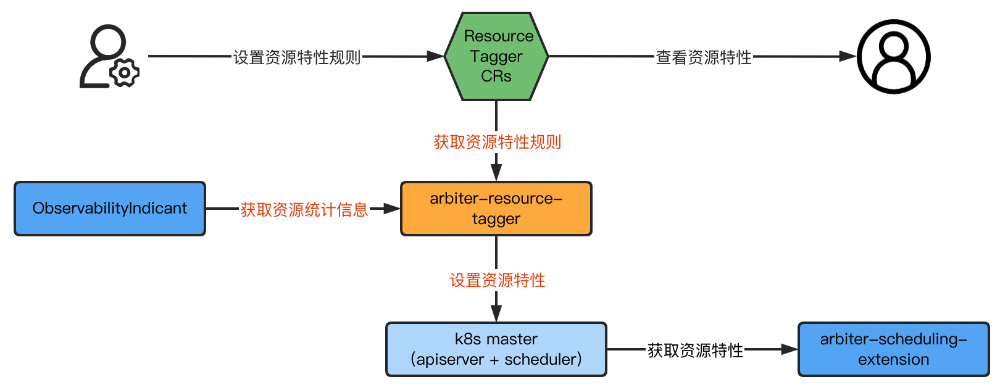
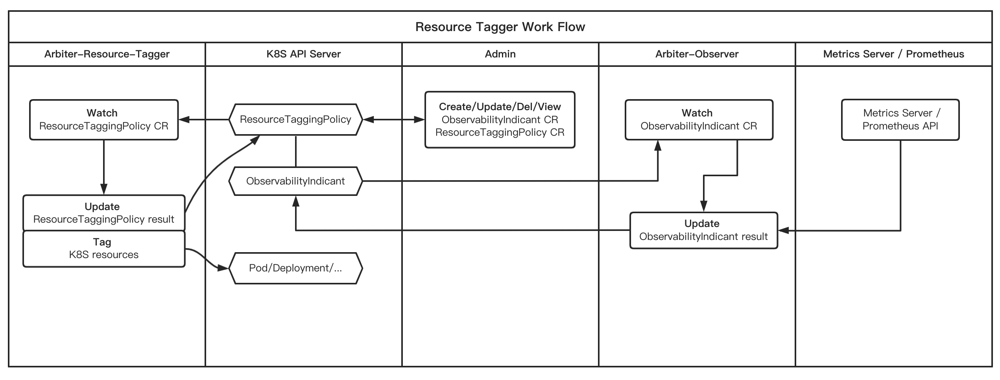

<!--
Executors define behaviors based on OBI metrics to allow users to quickly scale and automate desired operations.

1. Resource Tagger(Update Resource)
2. Power off node
-->
这里通过几个例子来介绍如何通过 Executor 来实现基于 OBI 指标的行为定义，以便让用户快速扩展实现期望的自动化操作。
1. Resource Tagger(更新资源)
2. Power off node

<!--
### Executor Function And Value
1. Through automatic detection and marking of resources running in the K8S cluster, users can have a more intuitive understanding of the characteristics of resources.
2. Based on these marked characteristics, the scheduler can make scheduling optimisation recommendations to schedule resources to more suitable nodes for operation.
3. By default, CPU-sensitive and memory-sensitive resource characteristics are detected and marked, but users can customize the resource characteristics and detection criteria according to their business requirements.
-->
### Resource Tagger 功能与价值

1. 通过自动检测、对 K8S 集群中运行的资源进行标记，让用户对资源的特性有一个更直观的了解。
2. 调度器可以根据这些标记出来的特性，做调度优化建议，将资源调度到更适合的节点运行。
3. 缺省提供 CPU 敏感、内存敏感两种资源特性的检测和标记，用户可以根据自己的业务需求，自定义资源特性和检测标准。

<!-- ### Executor Architecture -->
### Resource Tagger 架构

<!-- ### Executor Workflow -->
### Resource Tagger 工作流程

<!--
`executor` and `observer` do not interact through API calls, but data-driven interaction through data update and acquisition of ObservabilityIndicant CR.
-->
`executor` 和 `observer` 不通过 API 调用进行交互，而是通过数据更新和 ObservabilityIndi​​cant CR 获取的数据驱动交互。

<!--
### Data Driven Model Diagram

### Resource Tagger Demo
[executor update resource](../User%20Cases/update-resource.md)
-->
### 数据驱动模型

### Resource Tagger 例子
[executor update resource](../User%20Cases/update-resource.md)
