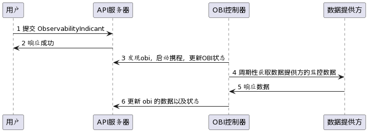
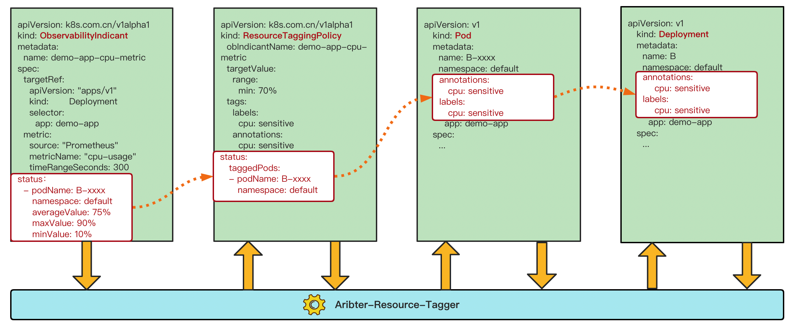

arbiter-observer 主要就是用来收集 metrics-server, prometheus 等相关的数据为调度器提供统一资源接入，
为调度器提供数据源。以及后续作为统一监控数据面板，提供数据可视化支持能力。

## 设计形式

arbiter-observer 主要实现为 `operator` 的形式。周期性获取监控数据填写到 status 字段中。
数据的获取形式，在第一个版本中支持到 metric-server，prometheus。
metric-server，prometheus 这类的数据源与 arbiter-server 通过 sidecar 方式部署。二者通过 `rpc`  和 `socket` 通信。  

arbiter-observer 通过资源的名字，或者标签来选择目标资源。目前 `ObservabilityIndicant` 没有对一组的数据进行处理，所以在使用标签的时候需要结合 index, 对于通过标签获取到的数据按照名称排序，选择 index。如果下标超过资源列表长度，不会启动任何获取数据协程。  

目前可以在 spec 中设置模板查询语句，例如 PromQL `sum(node_memory_MemTotal_bytes{instance="{{.metadata.name}}"} - node_memory_MemAvailable_bytes{instance="{{.metadata.name}}"})`.  在执行的时候，会将实际资源的信息填入到查询语句中。

**整体架构如图**


**时序图**



## GRPC 数据定义
```grpc
service Server {
    rpc GetPluginName (GetPluginNameRequest)
        returns (GetPluginNameResponse) {}
    
    rpc PluginCapabilities (PluginCapabilitiesRequest)
        returns (PluginCapabilitiesResponse) {}

    rpc GetMetrics (GetMetricsRequest)
        returns (GetMetricsResponse) {}
}
```

共定义三个接口，`GetPluginName` 获取数据源的名称，arbiter-observer 通过这个名称与 `ObservabilityIndicant` 的 `spec.source` 结合判断，
是否需要处理当前发生的事件。 `PluginCapabilitiyes` 告诉当前数据源支持哪些聚合逻辑，例如获取最大值，最小值等。 
最后一个函数 `GetMetrics` 就是用来获取监控数据。  

## CRD 定义

[observer-crd]

## 字段含义
1. source 字段  
`source` 通过与 `GetPluginName` 接口获取到的数据对比判断是否需要处理 `ObservabilityIndicant` 的变化。

2. metric 字段  
`metric.historyLimit` 这个字段表示保留多少条周期性获取的数据，例如 historyLimit=3， 在第三次获取数据后，数据为`[1, 2, 3]`, 
那么第四次获取数据后保留的数据为 `[2, 3, 4]`。  
`metric.metricIntervalSeconds` 表示获取数据的周期。    
`metric.timeRangeSeconds` 表示获取的数据的时间范围，`now-timeRangeSeconds, now`。  

3. targetRef 字段  
`targetRef` 用来确定一个 `ObservabilityIndicant` 关联的具体资源，例如 Pod，或者 Node。
```yaml
targetRef:
  group: ""
  index: 1
  kind: Node
  labels:
    beta.kubernetes.io/arch: amd64
  name: ""
  namespace: ""
  version: v1
```

使用 `group`, `kind`, `version` 来确定具体资源的类型以及版本，使用 `name` 或者 `labels+index`来确定具体的资源。
获取到资源后，即可利用该资源填充查询语句。

## Arbiter-Observer Demo

- prometheus

```yaml
apiVersion: arbiter.k8s.com.cn/v1alpha1
kind: ObservabilityIndicant
metadata:
  name: prometheus-node-mem
  namespace: arbiter
spec:
  metric:
    historyLimit: 1
    metricIntervalSeconds: 30
    metrics:
      memory:
        aggregations: []
        description: memory
        query: sum(node_memory_MemTotal_bytes{instance="{{.metadata.name}}"} - node_memory_MemAvailable_bytes{instance="{{.metadata.name}}"})
        unit: B
    timeRangeSeconds: 3600
  source: prometheus
  targetRef:
    group: ""
    index: 1
    kind: Node
    labels:
      beta.kubernetes.io/arch: amd64
    name: ""
    namespace: ""
    version: v1


# done
status:
  conditions:
  - lastHeartbeatTime: "2022-08-31T02:36:49Z"
    lastTransitionTime: "2022-08-31T02:36:49Z"
    reason: FetchDataDone
    type: FetchDataDone
  phase: Init
  metrics:
    memory:
    - endTime: "2022-08-31T02:37:50Z"
      records:
      - timestamp: 1661913360000
        value: "9530798080.000000"
      - timestamp: 1661913420000
        value: "9529155584.000000"
      startTime: "2022-08-31T01:37:50Z"
      targetItem: 21v-tc-zhangsh-team-10
      unit: B
```

- metrics-server

```yaml
apiVersion: arbiter.k8s.com.cn/v1alpha1
kind: ObservabilityIndicant
metadata:
  name: metric-mem-cost
  namespace: arbiter
spec:
  metric:
    historyLimit: 1
    metricIntervalSeconds: 30
    metrics:
      memory:
        aggregations:
        - time
        description: memory
        query: ""
        # 单位以实际 sidecar 返回为准
        unit: b
    timeRangeSeconds: 3600
  source: metric-server
  targetRef:
    group: ""
    index: 0
    kind: Pod
    labels: {}
    name: mem-cost-78ccff7d6b-qrjnn
    namespace: arbiter
    version: v1

# done
status:
  conditions:
  - lastHeartbeatTime: "2022-08-31T03:14:28Z"
    lastTransitionTime: "2022-08-31T03:14:28Z"
    reason: FetchDataDone
    type: FetchDataDone
  phase: Init
  metrics:
    memory:
    - endTime: "2022-08-31T03:14:28Z"
      records:
      - timestamp: 1661915668471
        value: "23356.000"
      startTime: "2022-08-31T02:14:28Z"
      targetItem: mem-cost-78ccff7d6b-qrjnn
      unit: Ki
```

## Resource Tagger 数据模型驱动图



### 关于 Observer Grpc 接口设计

#### GetPluginName

获取插件名字，如果不根据插件名称进行区分，那么就存在多个 controller 都处理同一个的情况，导致同一个资源被更新多次。

#### PluginCapabilities

插件支持的能力，对于能够支持 query 查询的数据源组件例如 prometheus 可以返回默认，使用 cr 的时候，直接填写 query 字段。
而不支持 query 的数据源组件例如 metric-server，则需要可以定义一个 时刻 的能力，返回请求时刻的资源的用量。

#### GetMetrics

这个就是获取数据源的请求体
对于存在 query 字段的， 直接发送请求，
对于不存在 query 的，则根据支持的能力发送请求
