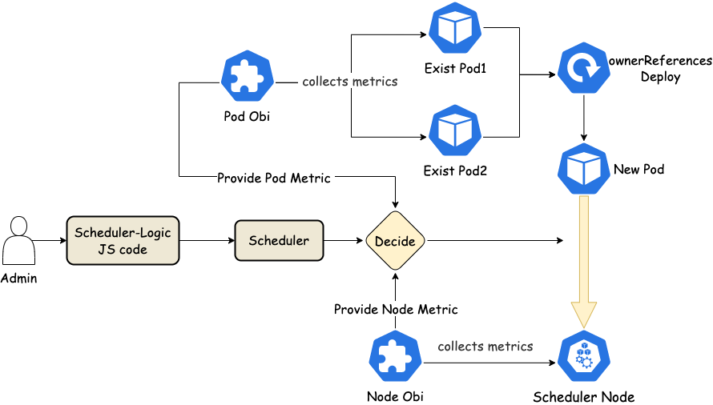

Use scheduler extension to use the data from OBI for pod scheduling.

## 功能与价值

1. 通过 Observer 将监控数据转换为 CRD obi 后的数据进行自定义调度。
2. 使用动态加载的 CRD 中的 JS 代码实现自定义调度，调度逻辑来自 JS 代码。
3. 在 JS 代码函数中，可以直接使用 obi 得到的数据。即 Pod.metric 和 Node.metric 可以直接使用。
4. 在 JS 代码函数中，可以直接使用一些方便函数。

## 架构

每次调度时，如果使用 `Pod.metric`，会拿到的是这个 Pod 的近似监控数据，具体的计算方式是：通过查找这个 Pod 的 ownerReferences,找到其所属的 Deployment 或者 StatefulSet，然后查找这个 Deployment 或者 StatefulSet 的 Pod 的监控数据，近似待调度 Pod 的监控数据。

